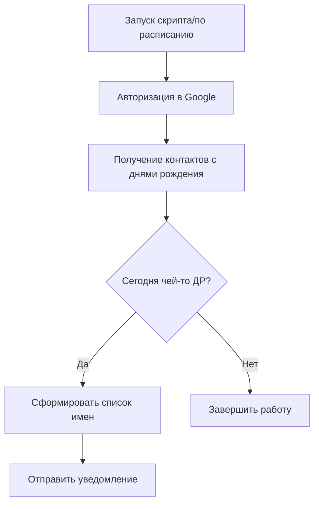

#### Tutor: Müller Alexader  
|==============================================================================================================|    
####  28.05.25  Home Work 06
###  AI  &  Python: 6 - Агентный подход в разработке с использованием LLM.  
|==============================================================================================================|    

### Tasks:  
1. Предложите идею простого агента для решения какой-либо задачи из веб-разработки или повседневной жизни,
которая была бы вам интересна или полезна.  
2. Опишите, какие инструменты ему понадобятся и как он будет работать.  
Например, это может быть агент, который помогает разработчику найти ошибки в коде, агент для выбора ресторана, 
агент для управления задачами и т.д.

---
## **ЗАДАНИЕ 1**  

**ИДЕИ**, которые давно занимают мои мысли:  
- Агент оповещения о дне рождения контакта из смартфона, а именно Google-контактов (OS Android, Google Pixel 7).  
- Агент по рисованию блок-схем различных алгоритмов из псевдокода или по фрагменту кода для визуализации.
- Агент по поиску вакансий, корректировке резюме и сопроводительного письма с учетом особенностей фирмы и 
   позиции, и их последующей отправке по электронной почте или через соцсеть.
---
## **ЗАДАНИЕ 2**  

### **Агент оповещения о дне рождения из Google-контактов** 
Проект, для реализации которого необходимы:  
- Python, 
- работа с API, 
- автоматизация, 
- некоторые UI/уведомления.

---

## 🧰 Инструменты, которые могут понадобиться

| Цель                          | Инструмент или библиотека                                               |
| ----------------------------- | ----------------------------------------------------------------------- |
| Доступ к Google-контактам     | `Google People API`                                                     |
| Аутентификация пользователя   | `Google OAuth2`, через `google-auth` и `google-auth-oauthlib`           |
| Обработка и фильтрация данных | `pandas` или обычный `datetime`, `calendar`                             |
| Планирование проверок         | `schedule`, `cron` (или `APScheduler`)                                  |
| Уведомления                   | Telegram-бот, email (`smtplib`), или десктоп-уведомления (`plyer`)      |
| Интерфейс (опционально)       | `tkinter`, `PyQt`, или консольный ввод                                  |
| Запуск на Android             | Termux, Kivy, или просто облачное приложение (например, PythonAnywhere) |

---

## 🔁 Логика работы агента

### 1. **Авторизация и доступ к контактам**

* Настроить Google Cloud Project → подключить **People API**.
* Получить `client_secret.json` и пройти аутентификацию.
* Использовать `googleapiclient.discovery.build` для получения контактов.

### 2. **Получение списка контактов с датами рождения**

* Использовать метод `people.connections.list`.
* Попросить у API поле `birthdays`.
* Фильтровать только тех, у кого день рождения есть.

### 3. **Проверка текущей даты**

* Каждый день в 8:00, например, скрипт сверяет текущую дату с днями рождения.
* Можно делать и за неделю до даты — чтобы успеть подготовиться.

### 4. **Уведомление**

* Отправка через Telegram-бота (удобно, быстро, бесплатно).
* Или — email, либо pop-up окно на рабочем столе.
* Формат: 🎉 «У Гидо сегодня День Рождения! 🎂»

---

## 📝 Пример архитектуры

---

## 📦 Альтернатива: Google Calendar

Если синхронизированы контакты с календарём:

* Можно считывать события из календаря через `Google Calendar API`.
* Это упростит задачу, т.к. календарь уже показывает ДР.

---

## 🔐 О безопасности

* ВАЖНО хранить `token.json` безопасно.
* Необходимо использовать `.env` и `dotenv` для хранения переменных (ключей, токенов и пр.).

---

## 🚀 Идеи на развитие

* Добавить возможность поздравлять автоматически (например, отправка сообщения в WhatsApp через Twilio API или email).
* UI-интерфейс с настройкой, кого и как поздравлять.
* Лог поздравлений — кого уже поздравили.

