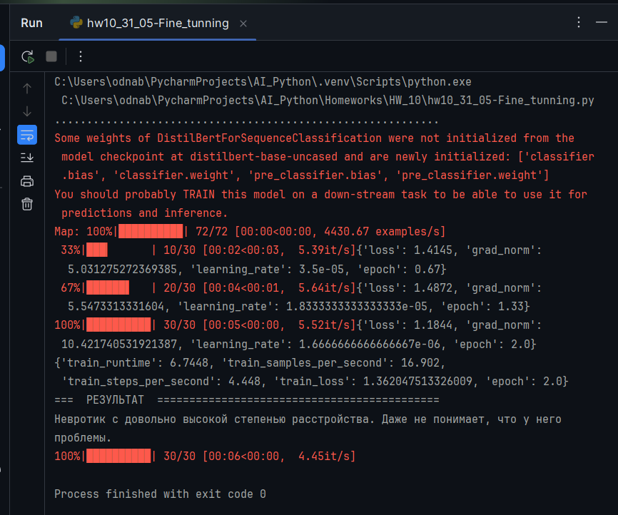

22-06-2025
## <a id="s6" style="color: #9000F0">Домашнее задание 10: Fine Tuning</a>    

### Задание:
  1. Выберите датасет  
     Найдите или создайте небольшой датасет для fine-tuning (например, классификация текстов,
     генерация ответов в специфической нише).
  2. Подготовьте данные  
     - Очистите текст от шума (например, удалите дубликаты, исправьте ошибки).  
     - Разбейте данные на обучающую и тестовую выборки.
  3. Fine-tune модель  
     Проведите обучение и оцените результат.
  4. Оцените качество модели  
     Протестируйте модель на тестовых данных.

### Реализация:

__"Классификатор является ли человек невротиком"__  

В обучающем датасете уровни указывают на:  
  - 4 - соответствует характеристике высокого уровня невротического расстройства.  
  - 0 - соответствует отсутствию невротического расстройства, характеризует уверенного в себе человека с
      адекватными личными границами, любящего себя.  

<a id="img1" style="margin: 40px; color:#606060;">Fig. 1. Результат для нормального человека.</a>

---

<a id="img1" style="margin: 40px; color:#606060;">Fig. 2. Результат для невротика.</a>

---
